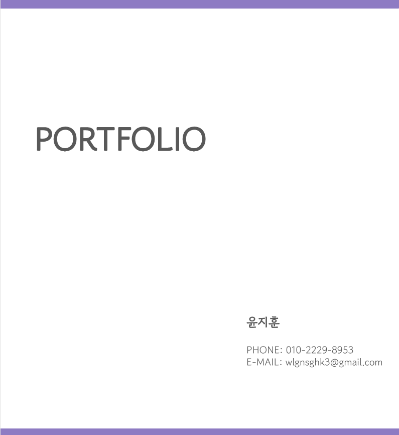
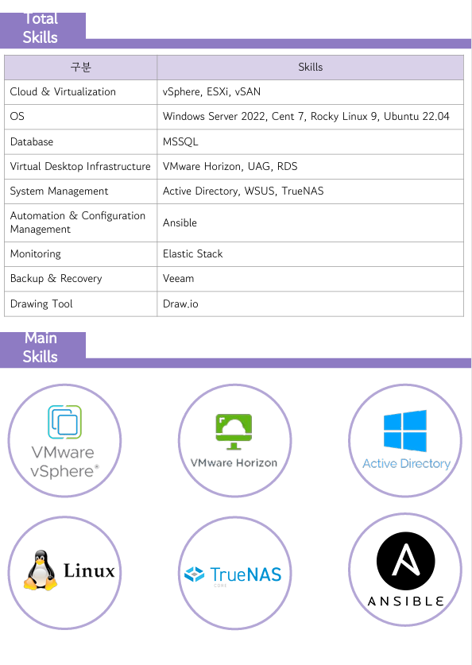
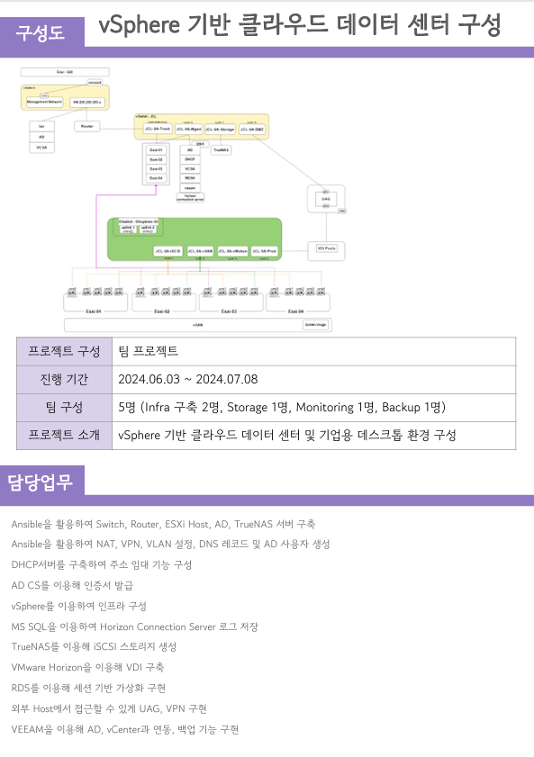

# 윤지훈 포트폴리오

안녕하세요, 윤지훈입니다. 저의 포트폴리오를 GitHub에서 바로 확인하실 수 있습니다.

---

## 🚀 포트폴리오 개요

* [cite_start]**이름**: 윤지훈 [cite: 3]
* [cite_start]**PHONE**: 010-2229-8953 [cite: 3]
* [cite_start]**E-MAIL**: wlgnsghk3@gmail.com [cite: 3]

---

## 🛠️ 보유 기술 스택 (Total Skills)

저의 주요 기술 스택은 다음과 같습니다:

* [cite_start]**Cloud & Virtualization**: vSphere, ESXi, vSAN [cite: 2]
* [cite_start]**OS**: Windows Server 2022, Cent 7, Rocky Linux 9, Ubuntu 22.04 [cite: 2]
* [cite_start]**Database**: MSSQL [cite: 2]
* [cite_start]**Virtual Desktop Infrastructure**: VMware Horizon, UAG, RDS [cite: 2]
* [cite_start]**System Management**: Active Directory, WSUS, TrueNAS [cite: 2]
* [cite_start]**Automation & Configuration Management**: Ansible [cite: 2]
* [cite_start]**Monitoring**: Elastic Stack [cite: 2]
* [cite_start]**Backup & Recovery**: Veeam [cite: 2]
* [cite_start]**Drawing Tool**: Draw.io [cite: 2]

**주요 활용 기술 (Main Skills):**
* [cite_start]VMware vSphere [cite: 2]
* [cite_start]VMware Horizon [cite: 2]
* [cite_start]Active Directory [cite: 2]
* [cite_start]Linux [cite: 2]
* [cite_start]TrueNAS [cite: 2]
* [cite_start]Ansible [cite: 2]

---

## 📈 프로젝트 경험: vSphere 기반 클라우드 데이터 센터 구성

### [cite_start]프로젝트 정보 [cite: 1]
* [cite_start]**프로젝트 구성**: 팀 프로젝트 [cite: 1]
* [cite_start]**진행 기간**: 2024.06.03 ~ 2024.07.08 [cite: 1]
* [cite_start]**팀 구성**: 5명 (Infra 구축 2명, Storage 1명, Monitoring 1명, Backup 1명) [cite: 1]
* [cite_start]**프로젝트 소개**: vSphere 기반 클라우드 데이터 센터 및 기업용 데스크톱 환경 구성 [cite: 1]

### [cite_start]담당 업무 [cite: 1]
본 프로젝트에서 제가 담당한 주요 업무는 다음과 같습니다:

* [cite_start]Ansible을 활용하여 Switch, Router, ESXi Host, AD, TrueNAS 서버 구축 [cite: 1]
* [cite_start]Ansible을 활용하여 NAT, VPN, VLAN 설정, DNS 레코드 및 AD 사용자 생성 [cite: 1]
* [cite_start]DHCP 서버를 구축하여 주소 임대 기능 구성 [cite: 1]
* [cite_start]AD CS를 이용해 인증서 발급 [cite: 1]
* [cite_start]vSphere를 이용하여 인프라 구성 [cite: 1]
* [cite_start]MS SQL을 이용하여 Horizon Connection Server 로그 저장 [cite: 1]
* [cite_start]TrueNAS를 이용해 iSCSI 스토리지 생성 [cite: 1]
* [cite_start]VMware Horizon을 이용해 VDI 구축 [cite: 1]
* [cite_start]RDS를 이용해 세션 기반 가상화 구현 [cite: 1]
* [cite_start]외부 Host에서 접근할 수 있게 UAG, VPN 구현 [cite: 1]
* [cite_start]VEEAM을 이용해 AD, vCenter와 연동, 백업 기능 구현 [cite: 1]

---

이 포트폴리오에 대한 자세한 문의사항은 위에 명시된 연락처로 문의 바랍니다.